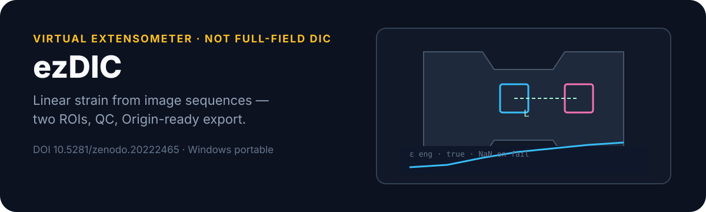

<p align="center">
  
</p>

# ezDIC

[](https://doi.org/10.5281/zenodo.20222465)

**A lightweight virtual extensometer for extracting linear strain from image sequences.**

Tracks two user-defined ROI markers across an image sequence and exports engineering strain, true strain, QC, and Origin-compatible TXT (optional OPJU). For researchers who need a reliable **1D strain history** without full-field DIC.

Developed by **Dr. Delun Gong** · [DOI 10.5281/zenodo.20222465](https://doi.org/10.5281/zenodo.20222465)

<p align="center">
  
</p>

| You need | ezDIC provides |
| --- | --- |
| Fast 1D strain | Two-ROI virtual extensometer |
| Honest failed frames | `NaN` instead of silent interpolation |
| Lab plotting | Origin-compatible TXT; optional OPJU |
| Multiple gauges | Mean ± SD / SEM; Poisson-ratio roles |
| No Python for users | Portable Windows folder with `ezDIC.exe` |

```text
Load images  →  Draw two ROIs  →  Track  →  Export strain + QC
```

### Outputs

```text
core/   strain_*.txt · optional OPJU · strain plots
qc/     qc_summary.txt
optional/  publication_figures/
```

Primary TXT:

```text
Frame	EngineeringStrain	TrueStrain
```

<p align="center">
  
</p>

```text
engineering strain = (L - L0) / L0
true strain        = ln(L / L0)
PoissonRatio       = - ε_transverse / ε_axial   (engineering)
```

Failed tracking frames stay `NaN`. Poisson uses role-averaged groups; tiny axial magnitude → `NaN`.

## Windows quick start

1. Download `ezDIC_Windows_x64_v0.1.3.zip` from [releases](https://github.com/D-sudoasd/ezDIC/releases)  
2. Extract full folder · keep `_internal/` next to `ezDIC.exe`  
3. Run `ezDIC.exe` · Windows 10/11 x64  

```powershell
py -m venv .venv
.\.venv\Scripts\python.exe -m pip install -r requirements.txt
.\.venv\Scripts\python.exe dic_virtual_extensometer_gui_v7_multi_roi_range.py
```

Build: `powershell -File .\build_release.ps1` · Tests: `py -m pytest -q`

## Limitations

Not full-field DIC — no strain maps, displacement fields, or local heterogeneity.

## Cite

```text
Gong, D. (2026). ezDIC (v0.1.3). Zenodo. https://doi.org/10.5281/zenodo.20222465
```

See `CITATION.cff`, `NOTICE_Attribution_and_Usage.txt`, and `LICENSE.txt` for attribution and redistribution terms.
